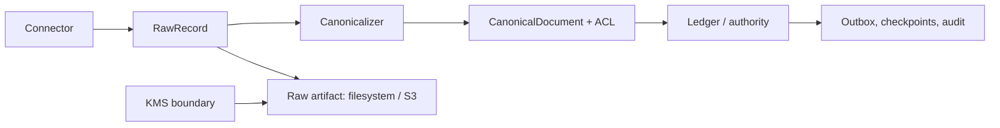
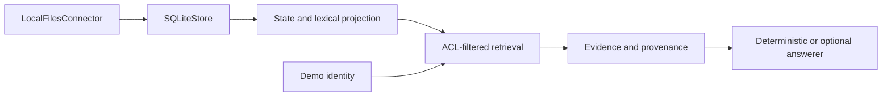

# Knowledge Pipeline — CodeWiki Report

> **Status: REFERENCE / LOCAL ONLY.** Real-data pilot is **NO-GO**. This report describes checked-in behavior, not production readiness.

## Overview

Knowledge Pipeline ingests local or connector-provided records, canonicalizes them, stores durable state and raw artifacts, builds retrieval projections, applies ACL filtering, and returns cited evidence or an optional grounded answer.

Runtime baseline: Python 3.11, Python standard-library HTTP server, static JavaScript frontend, and Nix tooling. Provider integrations enter through ports and adapters.

| Capability | Status |
|---|---|
| Local file scan and UTF-8 canonicalization | **Implemented — reference** |
| SQLite persistence and FTS5 lexical search | **Implemented — reference** |
| PostgreSQL authority path | **Implemented — synthetic contract; live evidence unavailable** |
| ACL-filtered retrieval and bounded answers | **Implemented — reference** |
| HTTP status/search/answer/report routes | **Reference/demo API only — production wiring not implemented** |
| OIDC/JWKS, KMS, S3, workflow, telemetry adapters | **Partial — adapter classes exist; CLI composition is incomplete** |
| External connectors, MIME, email, attachments, relationships, MCP | **Deferred / incomplete** |
| Production hosting, launcher, CI, observability, on-call | **Not found or incomplete** |
| Real-data pilot | **NO-GO** |

## Repository map

```text
kb-pipeline/
├── kb_pipeline/             Python domain, protocol, adapters, services, storage, API, CLI
├── frontend/                Static JavaScript/CSS/HTML UI shell
├── tests/                   unittest-discoverable unit, integration, security, recovery tests
├── docs/                    Architecture, runbooks, plans, reviews, evidence
├── pyproject.toml           Project metadata, Python requirement, dependencies, optional extras, pytest config
├── flake.nix                Pinned Nix development and QA commands
├── GATE*_QA_RESULTS.json    Checked-in reference/fixture evidence
└── README.md                Current status, commands, and production blockers
```

`pyproject.toml` defines project `kb-pipeline` version `0.1.0`, requires Python `>=3.11`, declares the PostgreSQL runtime dependency, and provides `openai`, `production`, and `test` optional dependency groups. It also configures pytest to discover tests under `tests/`. No container definition, CI workflow, or deployment launcher was found.

## Architecture diagrams



**PostgreSQL production path (current scope):** authenticated ingestion, authority, outbox, checkpoints, audit, and raw-artifact handling. It does **not** represent complete production retrieval, projection, or answer wiring. `PostgresIngestionService` is an ingestion/authority service; do not infer HTTP `search`, `answer`, or `report` methods from it.



**SQLite reference path:** retrieval, projection, cited evidence, and bounded answers. Mock mode exercises PostgreSQL authority with synthetic OIDC, KMS, S3-compatible storage, workflow, telemetry, and connector fixtures; it is not production evidence.

Production adapter classes exist, but CLI composition/launcher wiring is incomplete. Current production startup does not inject required KMS, encrypted raw-storage, workflow, telemetry, connector, and payload providers. `RuntimeConfig.validate()` therefore rejects current production setup before serving traffic.

## Component guide

| Component | Responsibility | Primary source |
|---|---|---|
| Domain model | `Input`, `RawRecord`, `SourceVersion`, `ACL`, `CanonicalDocument`, hits, audit events | [`domain.py`](../kb_pipeline/domain.py) |
| Connector and canonicalization | Acquire records; convert payloads to canonical text and metadata | [`adapters.py`](../kb_pipeline/adapters.py) |
| Protocol spine | Namespaces, stable object keys, envelopes, changes, permissions, provenance, ledger/store/projection/query contracts | [`protocol.py`](../kb_pipeline/protocol.py) |
| Service orchestration | Ingest, reconcile, tombstone, revoke, retrieve, answer, health, purge | [`service.py`](../kb_pipeline/service.py) |
| Composition | Validates mode/dependency compatibility and assembles runtime | [`composition.py`](../kb_pipeline/composition.py) |
| SQLite reference store | Documents, raw metadata, FTS5, audit, tombstones, revocations, checkpoints, purge state, embeddings | [`storage.py`](../kb_pipeline/storage.py) |
| PostgreSQL authority boundary | Authority-oriented ingestion service and repository | [`postgres_authority.py`](../kb_pipeline/postgres_authority.py) |
| Security | Principal, tenant/source authorization, OIDC/JWKS and test KMS boundaries | [`security.py`](../kb_pipeline/security.py) |
| Provider adapters | S3/KMS, managed OIDC, Temporal, OpenTelemetry boundaries | [`production_adapters.py`](../kb_pipeline/production_adapters.py) |
| HTTP API | Threading stdlib server, auth, limits, static assets, health/readiness | [`api.py`](../kb_pipeline/api.py) |
| CLI | Serve, index, rebuild, semantic/vision maintenance, backup/restore, evidence validation | [`cli.py`](../kb_pipeline/cli.py) |
| Embeddings | Bounded Ollama embedding client, vector validation, packing, and input hashing | [`embedding.py`](../kb_pipeline/embedding.py) |
| Vision | Bounded local Ollama image-observation adapter and schema validation | [`vision.py`](../kb_pipeline/vision.py) |
| Answering | Deterministic abstention plus explicit Ollama/OpenAI answer adapters and citation validation | [`answer.py`](../kb_pipeline/answer.py) |
| Mock environment | Synthetic OIDC, KMS, S3, workflow, telemetry, and connector fixtures; reference only | [`mock_environment.py`](../kb_pipeline/mock_environment.py) |
| Nango adapter | Synthetic Nango-shaped poll/webhook envelope adapter; transport and projections remain external | [`nango_adapter.py`](../kb_pipeline/nango_adapter.py) |
| Benchmark harness | Synthetic-local SLO/load measurements; does not export telemetry or qualify production | [`benchmark.py`](../kb_pipeline/benchmark.py) |
| Gate 6 tooling | Synthetic-local qualification and SQLite backup/restore recovery rehearsals | [`gate6.py`](../kb_pipeline/gate6.py), [`gate6_recovery.py`](../kb_pipeline/gate6_recovery.py) |
| Ingestion slice | Workflow-shaped ingestion boundary | [`ingestion_slice.py`](../kb_pipeline/ingestion_slice.py) |
| Temporal boundary | Temporal-facing ingestion orchestration | [`temporal_ingestion.py`](../kb_pipeline/temporal_ingestion.py) |
| Telemetry | Redacted metrics/tracing boundary | [`telemetry.py`](../kb_pipeline/telemetry.py) |
| Purge | Retention decisions, intents, receipts, and recovery state | [`purge.py`](../kb_pipeline/purge.py) |

## Data flow

### PostgreSQL authority/ingestion path

1. Connector emits `Input`/provider envelopes with identity namespace, payload, metadata, and permissions.
2. Service derives source version and content hash, canonicalizes payload, resolves ACL, and stages raw artifacts.
3. PostgreSQL authority accepts ordered changes, raw links, idempotency, outbox, audit, and checkpoints transactionally where supported.
4. Duplicate delivery is idempotent; stale, conflicting, and revision-gap changes are rejected or quarantined.

This path currently covers authenticated ingestion, authority, outbox, checkpoint, audit, and raw handling. Production projection, HTTP retrieval, HTTP answer, and HTTP report wiring is not implemented.

### SQLite reference retrieval path

1. `LocalFilesConnector` emits local records; `SQLiteStore` persists canonical documents, raw metadata/artifacts, FTS5 rows, and reference state.
2. State and lexical projections serve ACL-filtered retrieval; optional embeddings add semantic ranking.
3. Retrieval returns bounded hits and provenance. Deterministic or explicitly configured answerers receive bounded evidence; citation validation rejects unsupported claims and default mode abstains.

## APIs and CLI

### HTTP API

`create_server()` returns a `ThreadingHTTPServer`; it does not provide a service launcher or production hosting model.

| Method and route | Auth | Behavior |
|---|---|---|
| `GET /v1/health` | Public | Liveness response `{"status":"ok"}` |
| `GET /v1/ready` | Public | Readiness; returns `503` when storage, replay, gaps, dead letters, or projection lag fail checks |
| `GET /v1/status` | Auth; admin in production | **Reference/demo route:** store status and service health when supported |
| `GET /v1/report` | Auth; admin in production | **Reference/demo route:** counts, ledger/outbox, projection, readiness summary when supported |
| `GET /v1/search?q=...` | Auth | **Reference/demo route:** ACL-filtered hits; query and result limits apply |
| `POST /v1/answer` | Auth | **Reference/demo route:** JSON `{"query":"..."}`; bounded evidence and validated citations |
| Static frontend paths | Public | Allow-listed files under configured frontend root; sets HttpOnly `kb_session` cookie |

These four routes are reference/demo API surfaces, not production API contracts. Production HTTP retrieval/answer/report wiring is **not implemented**; current PostgreSQL composition uses `PostgresIngestionService`, which does not provide those methods. Demo/reference modes print process-local Bearer token. Production accepts configured OIDC Bearer tokens only and issues no local token. Errors use JSON fields `code`, `message`, `details`, and `trace_id`.

### CLI

```sh
python -m kb_pipeline.cli serve DB --source-root ROOT --port 8080
python -m kb_pipeline.cli serve DB --source-root ROOT --port 8080 --ollama-model MODEL
python -m kb_pipeline.cli index DB --source-root ROOT
python -m kb_pipeline.cli rebuild DB --source-root ROOT
python -m kb_pipeline.cli index-rebuild DB
python -m kb_pipeline.cli semantic-reindex DB --semantic-model MODEL
python -m kb_pipeline.cli vision-reextract DB --vision-model MODEL
python -m kb_pipeline.cli backup DB BACKUP_DIR
python -m kb_pipeline.cli restore DB BACKUP_DIR
python -m kb_pipeline.cli pilot-evidence DB --result-json RESULT.json
```

CLI `--mode` exposes `demo`, `mock`, and `production`. `RuntimeConfig` also validates `slice`; no current CLI choice exposes it. CLI validates loopback HTTP for explicit Ollama **answerer** endpoints. This report makes no shared endpoint-validation claim for semantic or vision providers. OpenAI mode is explicit and sends bounded query/evidence to cloud; do not use sensitive data.

## Configuration

| Setting | Default / requirement | Notes |
|---|---|---|
| Python | `>=3.11` | Nix pins supported toolchain; rerun evidence in supported runtime |
| Database | CLI positional `DB` | Demo uses SQLite; mock/production require PostgreSQL DSN |
| Source root | Current directory | Required outside mock/production |
| Host/port | `127.0.0.1:8080` | Port `0` supports isolated tests |
| Query length | 512 chars | Runtime range: 1–4096 |
| Results | 100 | Runtime range: 1–1000 |
| Request body | 16 KiB API handler default; 1 MiB runtime config default | Runtime range capped at 50 MiB |
| Projection lag | `0` | Readiness fails above configured maximum |
| Production OIDC | `OIDC_ISSUER`, `OIDC_AUDIENCE`, `OIDC_JWKS_URL` | Required by CLI production path |
| Raw storage | Filesystem in demo; S3 + KMS boundary for production | Production encryption adapter required |
| Answering | Deterministic abstention | Ollama/OpenAI only with explicit flags |
| Production composition | Required injected providers: OIDC, KMS, payload encryption, encrypted raw storage, workflow, telemetry, connector | CLI currently injects OIDC only; startup validation rejects setup |

## Persistence and recovery

SQLite enables WAL, foreign keys, `FULL` synchronous mode, a 30-second busy timeout, and serialized per-database writer access. It stores canonical documents, raw-record metadata, content-hash artifacts under `DB.raw`, FTS5 rows, audit events, tombstones, revocations, checkpoints, purge state, image extraction, and embeddings.

The protocol ledger supports idempotency, revision ordering, conflicts, gaps, outbox leases/retries, dead letters, and checkpoints. These are reference mechanisms; ledger, projections, audit, and external artifacts are not one production-authoritative transaction.

Backup stages SQLite plus raw artifacts, validates checksums and artifact links, then publishes a bundle. Restore validates before promotion and keeps previous copies. Recovery rehearsal:

```sh
python -m kb_pipeline.gate6_recovery
```

**Status: Partial / not production-qualified.** No proven cross-adapter deletion, atomic production backup/restore, persisted-artifact decryption read path, measured RPO/RTO, or crash-safe multi-stream recovery. Approved targets are RPO ≤24h and RTO ≤4h, pending qualifying evidence.

## Testing

Tests use Python `unittest` discovery under [`tests/`](../tests/). Coverage spans protocol, pipeline, ACL, restart/rebuild, raw artifacts, purge/recovery, security adapters, OIDC, mock PostgreSQL, semantic retrieval, vision, CLI startup, and telemetry/workflow boundaries.

Nix checks and commands are documented in [`nix-environment.md`](nix-environment.md). Checked-in gate results report fixture/reference passes, compile and Node smoke checks, and recovery evidence. **Status: reference evidence only; coverage unavailable; no production qualification.**

## Operations and deployment

Local operation uses the CLI and stdlib HTTP server. Readiness reports storage, replay, projection lag, gaps, and dead letters. Telemetry code and production adapter boundaries exist, but deployment, service supervision, alerting, tracing/export configuration, capacity model, on-call process, and operational rehearsal are incomplete.

**Status: Not production-ready.** No container, CI workflow, or deployment launcher found. `pyproject.toml` provides package metadata and dependency declarations, but does not provide deployment or service-launcher configuration. Production CLI composition also omits required KMS, encrypted raw storage, workflow, telemetry, connector, and payload providers; startup validation rejects current setup. See [`runbook.md`](runbook.md) for local operation and remediation order.

## Security model

- **Fail-closed ACL:** unresolved permissions never enter visible lexical retrieval; search rechecks tenant, source scope, ACL, tombstone, and revocation state.
- **Identity:** production boundary uses asymmetric OIDC/JWKS validation with issuer, audience, expiry, algorithm allow-list, and required claims. Demo/mock identities and validators are test/reference only.
- **Tenant isolation:** `Principal` binds tenant and source scopes; production composition rejects missing or test-only identity adapters.
- **Raw artifacts:** production adapter requires KMS envelope encryption, bound artifact context, integrity hash, and S3 key/context match. Local plaintext SQLite/filesystem path remains reference behavior.
- **Input/output limits:** bounded query, result, request, replay, and answer evidence sizes reduce abuse and accidental overexposure; rate limiting and quotas are absent.
- **Telemetry:** request logging records route/status rather than payloads; secrets and payloads are excluded by design. Production observability evidence is incomplete.
- **LLM boundary:** deterministic abstention is default; optional cloud answering warns that bounded query/evidence leaves process. Never send sensitive data.

**Security status: Reference boundary, not approval.** Real identity, key custody, encryption migration, tenant/source enforcement evidence, secret handling, and deployment controls remain open.

## Known limitations

1. Real-data pilot is **NO-GO**.
2. External connectors and Nango adapter are experiment/reference only; Nango cache is not an archive.
3. No accepted email, MIME, attachment, vector/relationship, MCP, or production projection path.
4. SQLite serialized access does not claim multi-writer production concurrency.
5. Ledger/outbox, raw, projections, audit, and external systems lack one proven production atomic workflow.
6. Purge removes local reference state but does not claim external projection, backup, cache, or audit-retention deletion.
7. Provenance and freshness metadata are partial; citation contract and groundedness evaluation remain incomplete.
8. Static UI is a shell; supported production hosting and UI/API composition are absent.
9. Synthetic-local performance and recovery measurements are not production SLO/RPO/RTO evidence.

## Navigation

### Start here

- [`README.md`](../README.md) — current status, local commands, acceptance targets, blockers
- [`architecture.md`](architecture.md) — implementation map and target-node mapping
- [`pilot-readiness.md`](pilot-readiness.md) — NO-GO decision and exit gates
- [`runbook.md`](runbook.md) — local demo operations and remediation order
- [`nix-environment.md`](nix-environment.md) — reproducible environment and QA commands

### Design and evidence

- [`mvp-plan.md`](mvp-plan.md) — acceptance gates
- [`protocol-mvp-plan.md`](protocol-mvp-plan.md) — protocol spine plan
- [`security-status.md`](security-status.md) — security review status
- [`phase2-security-review.md`](phase2-security-review.md) — security review
- [`GATE5_QA_RESULTS.json`](../GATE5_QA_RESULTS.json) — checked-in fixture QA result
- [`phase5-evidence-summary-2026-08-15.md`](evidence/phase5-evidence-summary-2026-08-15.md) — evidence summary and scope limits
- [`phase5-developer-test-operator-runbook-2026-08-15.md`](evidence/phase5-developer-test-operator-runbook-2026-08-15.md) — test/operator evidence

### Source, packaging, and UI

- [`kb_pipeline/`](../kb_pipeline/) — Python implementation
- [`pyproject.toml`](../pyproject.toml) — project metadata, dependencies, optional extras, and pytest configuration
- [`frontend/`](../frontend/) — static UI assets
- [`tests/`](../tests/) — unittest suite
- [`flake.nix`](../flake.nix) — Nix tooling
