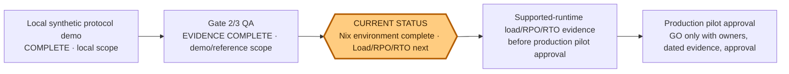

# Business knowledge pipeline progress map

**Snapshot:** 14 August 2026
**Decision:** **NO-GO for real-data pilot**
**Current stage:** **Nix environment — reproducible runtime complete ✅**
**Next stage:** **Supported-runtime load, RPO, and RTO evidence**

## Approved baseline acceptance criteria

Approved baseline targets: ingest **≥100 records/s**, search **p95 ≤100 ms**, RPO
**≤24h**, and RTO **≤4h**. These are acceptance criteria pending a qualifying run
in a supported runtime; they are not proof, production certification, or evidence
that current synthetic-local measurements meet pilot requirements.

`pipelineflow.png` is target architecture. This page overlays current repository
evidence on that target. Status separates three different questions:

- **Implementation:** checked-in behavior that runs on local/reference paths.
- **Reference:** contracts, orchestration, or fixtures that demonstrate intended shape.
- **Production readiness:** evidence needed for real-data operation. This remains **NO-GO**.

Security boundary validation now includes immutable `Principal`/`AuthZ` ports, fake
OIDC/JWKS validation, fake KMS AEAD envelopes with context binding, rotation and
erasure, production guards, and encrypted raw persistence tests. Fake-only scope.

Gate 5 validation is complete for reference scope: **76 tests passed twice**, six new
QA scenarios passed, compile and Node checks passed, and
[`GATE5_QA_RESULTS.json`](../GATE5_QA_RESULTS.json) records checksums, integrity,
restore, interruption, and failure outcomes. Coverage is unavailable. This evidence
does not establish production readiness.

Gate 6 SRE fixes are validated in synthetic local scope: access is serialized per
database, no multi-writer claim is made, the stress test passes, and readiness gates
on document projection lag. **78 tests passed twice**, with compile, Node, and git
checks passing. Reproducible environment evidence is now complete: `flake.nix` and
`flake.lock` pin Python **3.11.11**, Node **22.16**, and SQLite **3.46**; `nix flake
check` and packaged `check`, `benchmark`, and `evidence` apps pass. Production
qualification still requires supported-runtime load evidence and numeric SLO/RPO/RTO
evidence. Real-data status remains **NO-GO**.

Percentages are rough workstream estimates for those dimensions. They are not code
coverage, test pass rates, or pilot-readiness scores. New QA evidence does not change
these estimates.

## Target flow and current implementation

```mermaid
flowchart LR
    I[INPUT<br/>Business sources<br/>Impl 35% · Ref 45% · Prod 0%] --> C[CONNECTOR<br/>Acquire changes<br/>Impl 35% · Ref 45% · Prod 0%]
    C --> K[CAPABILITIES / SYNC<br/>Permissions · cursors · watch · resume<br/>Impl 20% · Ref 40% · Prod 0%]
    K --> R[RAW RECORDS<br/>Source-neutral envelope<br/>Impl 80% · Ref 80% · Prod 0%]
    R --> Z[CANONICALIZER<br/>Interpret and normalize<br/>Impl 45% · Ref 55% · Prod 0%]
    Z --> D[DOCUMENT PROCESSING<br/>Derived artifacts · models<br/>Impl 10% · Ref 30% · Prod 0%]
    D --> M[CANONICAL MODEL<br/>Business knowledge<br/>Impl 55% · Ref 65% · Prod 0%]
    M --> E[KNOWLEDGE ENGINE<br/>Store · project · index · secure · retrieve<br/>Impl 35% · Ref 55% · Prod 0%]
    E --> T[STORAGE TYPES<br/>SQLite · relational · object · vector<br/>Impl 35% · Ref 45% · Prod 0%]
    T --> Q[QUERY CONTRACTS<br/>Search · retrieve · evidence<br/>Impl 35% · Ref 45% · Prod 0%]
    Q --> O[OUTPUT<br/>API · web UI · consumers<br/>Impl 30% · Ref 40% · Prod 0%]

    E -. backup / resilience .-> B[BACKUP / RESILIENCE<br/>Restore · RPO/RTO · rehearsal<br/>Impl 25% · Ref 40% · Prod 0%]
    O -. target consumers .-> U[OUTPUT CONSUMERS<br/>MCP · agents · chat · applications<br/>Impl 0% · Ref 25% · Prod 0%]
    X[Cross-cutting foundations<br/>Identity · provenance · observability<br/>Impl 25% · Ref 40% · Prod 0%] -. required across flow .-> C
    X -.-> M
    X -.-> E

    classDef implemented fill:#d8f3dc,stroke:#237a3b,color:#12351d,stroke-width:2px;
    classDef partial fill:#fff0c2,stroke:#a56a00,color:#4a3000,stroke-width:2px;
    classDef deferred fill:#f0e7f8,stroke:#7851a9,color:#32184d,stroke-width:2px;
    classDef cross fill:#dcecff,stroke:#356da8,color:#102c4c,stroke-width:2px;
    class R implemented;
    class I,C,K,Z,D,M,E,T,Q,O,B partial;
    class U deferred;
    class X cross;
```



### Node detail

| Target stage | Current state | Evidence / missing scope |
|---|---|---|
| Input | **Impl 35% · Ref 45% · Prod 0%** | Local UTF-8 files work. Email, CRM, drives, databases, and other sources are deferred. |
| Connector | **Impl 35% · Ref 45% · Prod 0%** | Recursive local scan works. Scheduling, watch, resume, source permissions, and accepted production connectors do not. |
| Connector capabilities / sync | **Impl 20% · Ref 40% · Prod 0%** | Capability metadata, cursor/revision contracts, incomplete-snapshot safety, and experiment fixtures exist. Durable checkpointing, reconciliation, permission discovery, and failure-tested resume do not. |
| Raw records | **Impl 80% · Ref 80% · Prod 0%** | RawRecord/envelope/change contracts and SQLite raw path exist. This is not proof of durable production write coordination. |
| Canonicalizer | **Impl 45% · Ref 55% · Prod 0%** | Plaintext canonicalization works. MIME, attachments, extraction, and broader domain canonicalizers are absent. |
| Document processing / derived artifacts / models | **Impl 10% · Ref 30% · Prod 0%** | Basic document and lexical projection paths exist. Chunking, embeddings, vector indexes, model providers, derived-artifact lineage, and model operations are deferred. |
| Canonical model | **Impl 55% · Ref 65% · Prod 0%** | Canonical changes, identity fields, revisions, permissions, and provenance links exist. Full business model and lineage remain incomplete. |
| Knowledge engine | **Impl 35% · Ref 55% · Prod 0%** | SQLite/WAL, local SQLite ledger/outbox surfaces, state, projections, FTS5, lexical search, tombstones, revocations, and injected ACL filtering exist. No production-authoritative atomic workflow coordinates raw, canonical, projection, and audit effects. |
| Storage types | **Impl 35% · Ref 45% · Prod 0%** | SQLite and local raw-artifact storage exist; relational reference contracts exist. Object storage, vector storage, lifecycle policy, encryption, and production tenancy are absent. |
| Backup / resilience | **Impl 25% · Ref 40% · Prod 0%** | Fixture backup/restore validation and checksums exist. Atomicity under production locking, measured RPO/RTO, clean-host recovery, and rehearsal are unproven. |
| Query contracts | **Impl 35% · Ref 45% · Prod 0%** | Search, retrieval, ACL filtering, tombstones, and provenance-shaped results exist. Production authorization, freshness, citation completeness, and scale evidence do not. |
| Output / API / UI | **Impl 30% · Ref 40% · Prod 0%** | `python -m kb_pipeline.cli serve` provides local launcher; UI and API share same-origin `/` and `/v1/*` routes. Supported deployment, production token/identity, hosting, and composition remain absent. |
| Output consumers | **Impl 0% · Ref 25% · Prod 0%** | MCP, agents, chat, and application integrations are target scope only. |
| Identity / provenance / observability | **Impl 25% · Ref 40% · Prod 0%** | Injected ACL, URI/hash provenance, readiness/status fields, and redacted fixture logs exist. Production identity, tenant isolation, complete lineage, metrics, tracing, alerts, capacity, and on-call evidence do not. |

## Gate position



### Gate status

| Gate | Status | Validation evidence / closure gap |
|---|---|---|
| **Gate 1 — security and authority** | **UNOPENED / UNCLOSED** | SQLite ledger/outbox behavior and injected ACL tests exist, but no production-authoritative atomic workflow, authenticated identity, tenant isolation, source-enforced ACL, encryption, or key handling evidence exists. |
| **Gate 2 — durability and replay** | **EVIDENCE-COMPLETE / DEMO-REFERENCE SCOPE** | `GATE2_QA_RESULTS.json`: Python 3.11.12; 66/66 serial tests pass twice; 15/15 targeted protocol tests pass; compile smoke passes. Reference evidence only; production not cleared. |
| **Gate 3 — deletion, provenance, and recovery** | **EVIDENCE-COMPLETE / DEMO-REFERENCE SCOPE** | `GATE3_QA_RESULTS.json`: Python 3.11.12; 66/66 serial tests pass twice; 15/15 targeted tests pass; compile, Node, dynamic-port launcher, and health/readiness/UI smoke checks pass. Reference evidence only; production not cleared. |
| **Gate 4 — operations and product QA** | **FIXTURE-ONLY EVIDENCE** | `GATE4_QA_RESULTS.json` records fixture QA only. It excludes production claims and real-data pilot; it does not clear production readiness or pilot approval. |
| **Gate 5 — reliability core** | **✅ VALIDATED / FIXTURE-REFERENCE SCOPE** | `GATE5_QA_RESULTS.json`: 72 tests passed twice; six new QA scenarios passed; compile and Node checks passed; backup checksums, SQLite integrity, restore/interruption results, and injected-failure outcomes recorded. Production authority, external connectors/projections, load, measured RPO/RTO, and real-data approval remain open. |
| **Gate 6 — SRE evidence** | **⚠ REMEDIATION COMPLETE / SUPPORTED-RUNTIME EVIDENCE NEXT** | Per-database access is serialized; no multi-writer claim is made. Stress test passed, projection lag now gates readiness, and **78 tests passed twice**. Compile and Node checks passed. `.#benchmark` is QA preflight only; it is not production SRE evidence. Supported-runtime load and numeric SLO/RPO/RTO evidence remain open. |
| **Nix environment** | **✅ COMPLETE / REPRODUCIBLE** | `flake.nix`/`flake.lock` pin Python **3.11.11**, Node **22.16**, and SQLite **3.46**. `nix flake check`, `.#check`, `.#benchmark`, and `.#evidence` checks/apps are available and validated. |

### Gate timeline and stage completion

```text
Gate 1  Security and authority       [░░░░░░░░░░]  Unclosed
Gate 2  Durability and replay        [██████████]  Evidence-complete, demo/reference
Gate 3  Deletion and recovery         [██████████]  Evidence-complete, demo/reference
Gate 4  Operations and product QA     [██████░░░░]  Fixture-only evidence
Gate 5  Reliability + security        [██████████]  Validated, fixture/reference scope ✅
Gate 6  SRE remediation               [██████████]  Concurrency/readiness fixed ✅
Nix    Reproducible environment       [██████████]  Complete ✅
Next   Supported load + RPO/RTO        [░░░░░░░░░░]  Required
```

Gate 5 completion is visualized as **100% implemented reference scope**, not
production readiness. Rough production-evidence estimate: **35%** for reliability
core. Overall pilot readiness remains **0% / NO-GO** until blockers below close.

### Gate 5 reliability-core checklist

| Reliability area | Status | Reference implementation |
|---|---:|---|
| Ledger and outbox durability | **✅ Complete** | One SQLite transaction covers ledger acceptance, outbox creation, raw metadata, and audit callbacks; outbox has durable lifecycle, leases, bounded attempts, and dead letters. |
| SQLite settings | **✅ Complete** | WAL, `synchronous=FULL`, foreign keys, busy timeout, and process-local writer lock configured. |
| Gap and checkpoint replay | **✅ Complete** | Contiguous sequence validation, persistent gaps, no-skip acceptance, and monotonic checkpoint bounds. |
| Artifact reference safety | **✅ Complete** | Durable content-hash reference counts prevent removal while references remain. |
| Purge tracking | **✅ Complete** | Source/document-scoped, resumable purge status tracks running, complete, and failed states. |
| Readiness and metrics | **✅ Reference / ⚠ rerun pending** | Health, readiness, and status surfaces expose ledger, outbox, checkpoint, projection, and metrics state; document projection lag now gates readiness. |
| Principal/AuthZ ports | **✅ Complete** | Immutable Principal and provider-neutral authorization ports enforce tenant/source decisions in reference composition. |
| OIDC/JWKS validator | **✅ Fake-only** | Offline fake validator checks signature, issuer, audience, expiry, tenant, role, and source claims. |
| KMS envelope boundary | **✅ Fake-only** | Fake KMS provides authenticated AEAD envelopes, bound context, rotation, retirement, and erasure states. |
| Production guards | **✅ Complete** | Production composition rejects fake identity and key providers. |
| Encrypted raw persistence | **✅ Reference tests** | Raw persistence uses encrypted envelopes with no plaintext fallback. Canonical ledger encryption migration is not complete. |

### Gate 5 validation evidence

| Evidence | Result |
|---|---|
| Test execution | **✅ 76 tests passed twice** |
| New QA coverage | **✅ Six new Gate 5 scenarios passed** |
| Static/runtime/repository checks | **✅ Compile, Node, and git checks passed** |
| Evidence artifact | **✅ `GATE5_QA_RESULTS.json` recorded and linked to `tests/test_manifest.json`** |
| Integrity and recovery records | **✅ SHA-256 checksums, SQLite integrity, restore validation, and interruption outcomes recorded** |
| Failure handling | **✅ Injected failures rolled back or retried as asserted; no unexpected failures** |
| Coverage report | **⚠ Unavailable; test count is not coverage** |

### Gate 6 remediation evidence

| Measurement or check | Result | Qualification |
|---|---:|---|
| Baseline ingest | **694.8 records/s** | Synthetic local measurement; no production capacity claim |
| Baseline search | **Synthetic-local measurement** | No production performance claim; machine-specific timing is not retained |
| Replay | **2607 records/s** | Synthetic local measurement |
| Backup / restore | **Synthetic-local checks** | Integrity and failure-injection checks passed; recovery rehearsal targets remain acceptance criteria |
| Concurrent API readers | **20/20 HTTP 200** | Bounded API probe; latency not captured; does not clear SQLite concurrency |
| Database access policy | **✅ Remediated** | Access is serialized per database; no multi-writer claim is made |
| Concurrency stress test | **✅ Passed** | Stress test passed under serialized per-database access |
| Readiness lag policy | **✅ Remediated** | Document projection lag gates readiness |
| Regression validation | **✅ Passed** | **78 tests passed twice**; compile, Node, and git checks passed |
| Runtime support | **✅ Complete** | Reproducible Nix environment pins Python **3.11.11**, Node **22.16**, and SQLite **3.46** |
| Supported-runtime load | **⚠ Pending** | Run load evidence inside pinned environment; benchmark app remains QA preflight only |
| SLO/RPO/RTO comparison | **⚠ Pending** | Define numeric targets and compare measured load/recovery evidence |
| Synthetic-local recovery rehearsal | **✅ Commanded / reference scope** | `python -m kb_pipeline.gate6_recovery` validates SQLite integrity, raw-artifact links, pre-backup retrieval, and post-backup absence; RPO **≤24h** and RTO **≤4h** remain acceptance criteria only |

Gate 6 remediation results are validation evidence, not production certification.
Do not present stress-test success or serialized access as a production guarantee.
Approved baseline targets remain pending until a supported-runtime qualifying run
records comparable measurements.
The recovery rehearsal is not production disaster recovery or pilot approval.

### Reference reliability versus production blockers

**Implemented reference reliability:** local SQLite write coordination, durable
ledger/outbox state, replay guards, gap quarantine behavior, reference-safe artifact
purge, staged backup validation, resumable purge tracking, and operational status
surfaces.

**Remaining production blockers:**

- Real OIDC/KMS integrations, authenticated tenant isolation, and key lifecycle.
- Decryption read path for persisted raw artifacts and canonical ledger encryption migration.
- External projection purge across adapters, indexes, caches, backups, and retention boundaries.
- Dedicated concurrency, crash-injection, restore, and failure-rehearsal evidence with measured RPO/RTO.
- Load/performance evidence and production SLO budget remain unavailable.
- Gate 6 remediation uses serialized per-database access; do not claim multi-writer support.
- Gate 6 stress and readiness fixes pass synthetic validation; production scope remains unproven.
- Supported-runtime load evidence is not yet recorded.
- No supported-runtime qualifying comparison exists, so measurements cannot yet be
  accepted against baseline targets.
- Approved baseline targets are acceptance criteria only: ingest **≥100 records/s**,
  search **p95 ≤100 ms**, RPO **≤24h**, and RTO **≤4h**. They remain unqualified
  pending a supported-runtime run.
- Accepted external connectors and production projection integrations remain unproven.
- Connector implementation may proceed only in local/reference scope. Production
  connector adoption remains blocked on external identity/KMS, production-grade
  recovery and operations, and real-data approval.

### Local/reference answer mode

Default behavior is deterministic abstention. Generated answers require explicit
local Ollama opt-in and citations to retrieved evidence. This mode is local/reference
only and does not approve real-data or production use.

Ollama install, start, and model-pull steps remain generic platform-supported
placeholders. Verified explicit opt-in serve usage is
`python -m kb_pipeline.cli serve DB --source-root ROOT --port 8080 --ollama-model MODEL`.
Optional flags are `--ollama-endpoint LOOPBACK_ENDPOINT` and
`--ollama-timeout SECONDS`; these activate only local/reference behavior.

LLM parent dependencies remaining: citation contract (partial), provider config,
injection/data boundary, and groundedness evaluation.
- Production-authoritative composition, observability/alerts, capacity evidence, and on-call procedures.
- Real-data rehearsal, owner sign-off, and pilot approval.

### Evidence environment note

The reproducible environment is complete: checked-in `flake.nix` and `flake.lock`
pin Python **3.11.11**, Node **22.16**, and SQLite **3.46**. `nix flake check`,
`nix run .#check`, `nix run .#benchmark`, and `nix run .#evidence` validate the
environment and QA tooling. The benchmark app is QA preflight only, not production
SRE, capacity, SLO, RPO, or RTO evidence. Dynamic-port test isolation uses OS-assigned
port 0 instead of a fixed port.

## Real-data pilot blockers

- No production-authoritative atomic workflow coordinating all effects. Local SQLite
  ledger/outbox paths are reference/demo components, not production authority.
- No production identity, namespace isolation, encryption, or source ACL boundary.
- Production auth/KMS remains excluded; fake OIDC/JWKS and fake KMS are reference
  adapters, not production authorization or key-management evidence.
- Connector capabilities, sync resume, document processing, derived artifacts, and
  accepted non-local sources remain unproven.
- Replay/checkpoint behavior is reference-shaped, not crash-safe evidence.
- Purge, backup/restore, RPO/RTO, and cross-adapter deletion remain unproven.
- API/UI now has local serve launcher and same-origin routing, but lacks supported
  production hosting, identity/token path, and composition/deployment evidence.
- No production observability, capacity evidence, alerts, or on-call operation.
- Nango adapter remains experiment-only; revisions, retention, permissions, replay,
  purge, and credentials lack production evidence.
- Dynamic-port test isolation fix removes prior fixed-port collision from covered QA.
  This is test isolation evidence, not production concurrency evidence.

## Next action

**Exact next action:** run supported-runtime load testing and record numeric
SLO/RPO/RTO evidence inside pinned Nix environment. Continue production hardening
for OIDC/KMS, connectors/projections, observability, and recovery rehearsal. Keep
all input synthetic until pilot owner approves exit gates.

## Source of truth

- Target: [`pipelineflow.png`](../pipelineflow.png), [`BII.md`](../BII.md)
- Implementation mapping: [`architecture.md`](architecture.md)
- Gate plan: [`mvp-plan.md`](mvp-plan.md), [`runbook.md`](runbook.md)
- Pilot decision and blockers: [`pilot-readiness.md`](pilot-readiness.md)
- QA/SRE evidence: [`GATE2_QA_RESULTS.json`](../GATE2_QA_RESULTS.json), [`GATE3_QA_RESULTS.json`](../GATE3_QA_RESULTS.json), [`GATE4_QA_RESULTS.json`](../GATE4_QA_RESULTS.json), [`GATE5_QA_RESULTS.json`](../GATE5_QA_RESULTS.json), and [`GATE6_SRE_RESULTS.json`](../GATE6_SRE_RESULTS.json)
